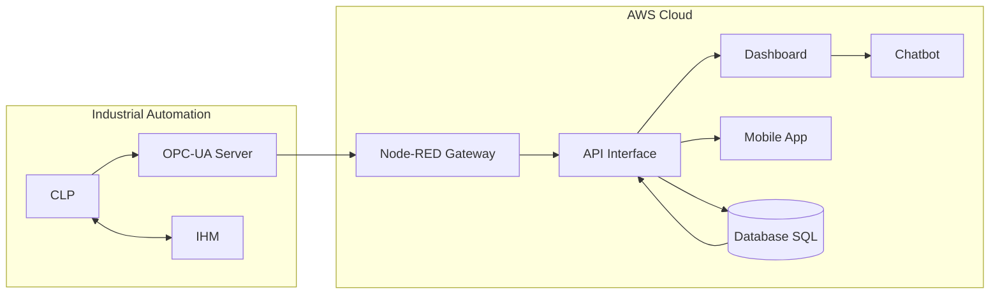

# **Integrative Project: EcoSort**

## Overview:

## Contexto:

A indústria de reciclagem enfrenta desafios significativos relacionados à separação de materiais recicláveis, especialmente entre metais e plásticos. A mistura desses materiais resulta em altos custos, baixa qualidade e redução na produtividade. A falta de automação e um sistema inteligente de monitoramento contribuem para esses problemas, tornando essencial o desenvolvimento de uma solução integrada.

## Descrição:

O objetivo deste projeto é desenvolver uma solução tecnológica para otimizar o processo de separação de materiais recicláveis, com foco em:
- Aumentar a eficiência operacional.
- Implementar automação e inteligência no processo de separação.
- Melhorar a análise de dados para decisões mais estratégicas.

## Fases do Projeto:

O projeto será dividido em **duas fases principais**:

1. **Fase 1**: Desenvolvimento de uma solução automatizada básica para separação de materiais, com integração inicial de sistemas de controle.
2. **Fase 2**: Implementação de uma plataforma inteligente para análise e monitoramento em tempo real do desempenho do processo de separação, permitindo ajustes dinâmicos e otimização contínua.

## Desafios a Serem Resolvidos

- **Baixa automação** no processo de separação, dependendo de operações manuais.
- **Falta de dados estruturados** para análise e controle eficiente.
- **Pouco controle sobre a eficiência operacional**, dificultando a gestão e a melhoria contínua.

----

## Documentação:

1. [Padrões de Commits](docs/commit-patterns.md)  
2. [Gerenciamento de Branches](/docs/branch-management.md)