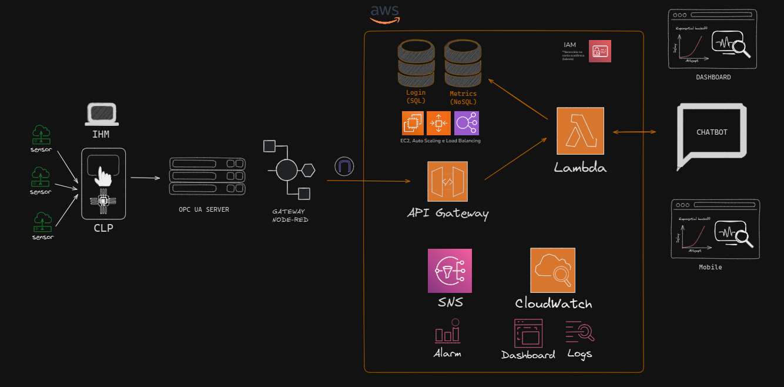

# 🏭 Projeto Integrador com AWS

Este projeto tem como objetivo utilizar tecnologia 
e automação para otimizar a separação dos 
materiais recicláveis, aumentando a eficiência do 
processo e aprimorando a análise de dados para 
tomada de decisões.

## 👀 Colaboradores:

- Gabriel Alvim
- Gustavo Monteiro
- Gustavo Souza
- Kauan Izidoro
- Rafael Serio

## 📈 Fluxo Geral do Projeto

1. **Sensores Industriais** enviam dados para o **CLP (Controlador Lógico Programável)**.
2. O **CLP** processa os sinais e envia os dados via protocolo **OPC UA**.
3. O **Node-RED** atua como **Gateway**, capturando os dados do servidor OPC UA e os enviando para a nuvem.
4. Dados são transmitidos para o **API Gateway** na AWS, que serve como ponto de entrada para o backend.
5. O **Lambda** processa os dados recebidos, armazenando e analisando conforme necessário.
6. Dados são armazenados em bancos **SQL (Login)** e **NoSQL (Métricas)**.
7. O **CloudWatch** monitora o sistema e envia alertas via **SNS**.
8. Informações são exibidas em **Dashboards Web e Mobile**, além de um **Chatbot** com acesso a dados em tempo real.

## ☁️ Serviços AWS Utilizados

### 1. **Amazon API Gateway**
- **Função:** Porta de entrada para as requisições externas que chegam do Node-RED.
- **Uso no Projeto:** Recebe os dados do Gateway Node-RED e os encaminha para a função Lambda.
- **Benefício:** Escalável, seguro e sem servidor, permite controle de tráfego e autenticação.

---

### 2. **AWS Lambda**
- **Função:** Computação serverless para processar os dados recebidos.
- **Uso no Projeto:**
  - Processa os dados industriais.
  - Consulta e grava nos bancos de dados.
  - Interage com o chatbot e dashboards.
- **Benefício:** Custo baseado em uso, sem necessidade de provisionamento de servidores.

### 3. **Amazon CloudWatch**
- **Função:** Monitoramento e observabilidade.
- **Uso no Projeto:**
  - Logs das execuções das funções Lambda.
  - Alarmes configurados para condições críticas.
  - Dashboards de monitoramento em tempo real.
- **Benefício:** Análise de desempenho, alertas automáticos e visualização.

---

### 4. **Amazon SNS (Simple Notification Service)**
- **Função:** Serviço de envio de notificações.
- **Uso no Projeto:**
  - Notificação em tempo real em caso de falha, anomalias ou limites excedidos.
  - Integração com CloudWatch para envio automático.
- **Benefício:** Comunicação ágil via e-mail, SMS ou HTTP.

---

### 5. **IAM (Identity and Access Management)**
- **Função:** Gerenciamento de acesso seguro aos recursos da AWS.
- **Uso no Projeto:**
  - Criação de políticas específicas para Lambda, DynamoDB, RDS, etc.
  - Controle de permissões para usuários e serviços.
---

### 6. **Amazon EC2 (Elastic Compute Cloud)**
 - **Função**: Computação escalável na nuvem com suporte a Auto Scaling e Load Balancing.

 - **Uso no Projeto**:

    - Prover instâncias que podem ser utilizadas para guardar os dados de login(SQL) e metricas da aplicação (NoSQL).

    - Apoiar o balanceamento de carga e escalar horizontalmente quando o volume de dados ou usuários aumenta se necessário.

 - **Benefício**: Alta disponibilidade, elasticidade automática, e maior controle sobre o ambiente de execução quando necessário.

---

### 7. **Auto Scaling**

 - **Função**: Ajuste automático da capacidade computacional com base na demanda.

 - **Uso no Projeto**:

   - Permite que instâncias do Amazon EC2 sejam adicionadas ou removidas automaticamente conforme a necessidade.

   - Garante que o sistema continue performático mesmo em momentos de alto tráfego ou carga de trabalho intensa.

 - **Benefício**: Otimiza custos com recursos sob demanda e melhora a resiliência da aplicação, evitando gargalos.

 ---

### 8. **Elastic Load Balancing (ELB)**
 - **Função**: Distribuir automaticamente o tráfego de entrada entre várias instâncias do Amazon EC2.

 - **Uso no Projeto**:

    - Trabalha em conjunto com o Auto Scaling para manter a distribuição de carga equilibrada entre as instâncias.

    - Ajuda a aumentar a tolerância a falhas, direcionando o tráfego apenas para instâncias saudáveis.

 - **Benefício**: Alta disponibilidade, escalabilidade e melhor desempenho da aplicação.